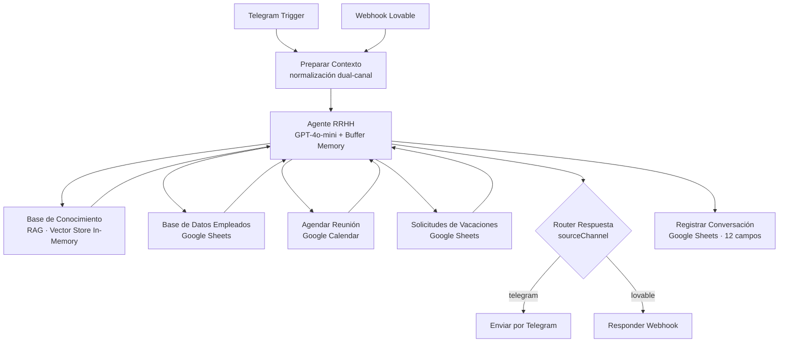
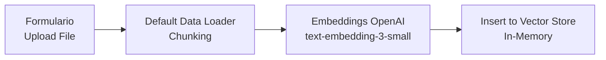

# NovaBot — Agente de IA para RRHH y Automatización Multicanal
---
## Breve introducción: ¿Qué es un agente de IA?

Un **agente de inteligencia artificial** es un sistema de software autónomo diseñado para **percibir su entorno, tomar decisiones y ejecutar acciones independientes con el fin de alcanzar un objetivo específico sin supervisión humana constante**. A diferencia de los chatbots tradicionales, que solo responden preguntas basándose en instrucciones inmediatas, los agentes de IA tienen la capacidad de razonar, descomponer un objetivo en subtareas y utilizar herramientas externas (como APIs o bases de datos) sin necesidad, como ya mencioné, de supervisión humana constante. 

Para operar de forma independiente, los agentes modernos integran cuatro pilares esenciales: 

* Percepción: Recopila información mediante texto, voz, imágenes o sensores.
* Cerebro (LLM): Modela el razonamiento utilizando modelos de lenguaje avanzados.
* Memoria: Retiene interacciones previas a corto y largo plazo para mantener el contexto.
* Acción: Ejecuta tareas conectándose a herramientas como CRMs, calendarios o correos electrónicos.

Dicho esto, continuemos con este proyecto.
---
## Descripción del proyecto

Diseño e implementación de un asistente de RRHH conversacional sobre **n8n**, accesible vía **Telegram** y **web chat (Lovable)**. El agente responde consultas sobre políticas internas mediante RAG, gestiona solicitudes de vacaciones, agenda reuniones en Google Calendar y consulta bases de empleados en Google Sheets — centralizando en un solo pipeline tareas que antes requerían múltiples sistemas e intervención humana.


---

## Resumen del workflow


- **Orquestación**: n8n como pipeline visual
- **Inteligencia**: GPT-4o-mini + tool-calling (4 herramientas distintas)
- **Memoria**: Window Buffer Memory para contexto multi-turno
- **Recuperación**: RAG con embeddings (text-embedding-3-small) + Vector Store
- **Multi-canal**: Telegram + Lovable con normalización unificada de inputs en un nodo dedicado
- **Integraciones externas**: Google Sheets, Google Calendar, Google Drive
- **Logging**: 12 campos registrados por conversación, 9 categorías de consulta clasificadas
- Sub-workflow separado para ingesta RAG

*Observación*: **los datos utilizados en este proyecto son sinteticos, no son de una empresa real.**
---

## 🎯 Problema

Los equipos de RRHH invierten una fracción significativa de su tiempo respondiendo consultas repetitivas de empleados: días de vacaciones disponibles, políticas de trabajo remoto, solicitudes de permisos, agendamiento de reuniones. Estas tareas, aunque necesarias, no agregan valor estratégico al área. **NovaBot** automatiza este flujo mediante un agente conversacional que accede en tiempo real a los sistemas de la empresa, liberando al equipo de RRHH para tareas de mayor impacto.

---

## 🗂️ Datos y Fuentes

| Atributo       | Detalle                                                        |
|----------------|----------------------------------------------------------------|
| Fuente         | Google Sheets (empleados, vacaciones, conversaciones), Google Drive (documentos de políticas) |
| Formato        | JSON (Telegram/Webhook), Google Sheets (estructurado), documentos de texto (RAG) |
| Volumen        | Base de datos de empleados ficticia · Documentos de políticas de empresa |
| Licencia       | Sintética — datos de ejemplo, no usar en producción           |

**Transformaciones relevantes:** Los inputs de dos canales distintos (Telegram y Lovable webhook) se normalizan en el nodo `Preparar Contexto` hacia un esquema unificado (`userName`, `userId`, `userMessage`, `sourceChannel`, `chatId`), eliminando la necesidad de lógica duplicada aguas abajo en el pipeline.

---

## ⚙️ Metodología y Arquitectura

El sistema sigue una arquitectura de **agente con herramientas (tool-calling)** orquestado en n8n, con RAG para recuperación de documentos y memoria de ventana deslizante para mantener contexto conversacional. Se eligió n8n como orquestador por su capacidad de integrar servicios externos sin código adicional, su interfaz visual que facilita el debugging, y su compatibilidad nativa con los nodos de OpenAI y Google Workspace.

Se descartó una arquitectura basada en LangChain puro dado que el proyecto prioriza integraciones con APIs de terceros sobre flexibilidad algorítmica, lo que hace que n8n sea más eficiente para este caso de uso.



### Sub-workflow de Ingesta RAG



### Decisiones de Diseño Clave

| Decisión | Alternativa considerada | Razón de elección |
|---|---|---|
| n8n como orquestador | LangChain + FastAPI | Integración nativa con Google Workspace y Telegram sin boilerplate |
| GPT-4o-mini | GPT-4o | Costo-eficiencia suficiente para consultas de RRHH estructuradas |
| Vector store in-memory | Pinecone / Qdrant | Simplicidad para prototipo; identificado como limitación a resolver |
| Window Buffer Memory | Sin memoria | Permite mantener contexto en solicitudes de vacaciones multi-turno |
| Normalización en nodo dedicado | Lógica por canal separada | Evita duplicación y facilita agregar nuevos canales sin refactorizar |

---

## 📊 Resultados y Evaluación

Este proyecto es un **prototipo funcional** orientado a demostrar la arquitectura. Los KPIs evaluados son operacionales:

| KPI | Resultado |
|---|---|
| Canales soportados | 2 (Telegram + Lovable web chat) |
| Herramientas integradas | 4 (RAG, Empleados, Calendar, Vacaciones) |
| Campos registrados por conversación | 12 |
| Tipos de consulta clasificados | 9 categorías |
| Cobertura de flujos RRHH | Políticas · Vacaciones · Reuniones · Consulta de empleados |

**Observaciones:** El agente maneja correctamente solicitudes multi-turno gracias a la memoria de ventana. La clasificación de tipo de consulta (`Tipo de Consulta`) es el componente más frágil: al basarse en keywords del output del agente, puede producir categorías inconsistentes cuando la respuesta varía en redacción.

---

## 💡 Conclusiones

**Limitaciones conocidas:**
- El vector store in-memory pierde los documentos indexados al reiniciar el workflow. Requiere migración a Qdrant o Supabase pgvector para producción.
- La clasificación de tipo de consulta por keyword matching es frágil; una solución más robusta es instruir al agente vía system prompt para que emita un tag estructurado (`<tipo>Vacaciones</tipo>`).
- El campo `chatId` queda vacío para solicitudes desde Lovable, lo que puede causar problemas si se agregan funcionalidades que dependan de él.
- CORS configurado como `*` en el webhook; en producción debe restringirse al dominio de Lovable.

**Aprendizaje técnico principal:** La normalización de inputs en un nodo dedicado al inicio del pipeline es crítica en arquitecturas multi-canal. Hardcodear referencias específicas de un canal (ej. `$json.message.chat.first_name`) rompe el flujo para otros canales y genera deuda técnica difícil de rastrear. Un único nodo de contexto garantiza que el resto del pipeline sea agnóstico al origen.

---

## 🚀 Reproducibilidad

```bash
git clone https://github.com/tu-usuario/novabot-rrhh.git
cd novabot-rrhh
cp .env.example .env
# Completa las variables en .env con tus credenciales reales
```

### Requisitos previos

| Herramienta | Versión | Rol |
|---|---|---|
| n8n | ≥ 1.40 | Orquestador del workflow |
| OpenAI API | gpt-4o-mini · text-embedding-3-small | Agente + Embeddings |
| Google Workspace | Sheets + Calendar | Base de datos y agendamiento |
| Telegram Bot | vía @BotFather | Canal de chat principal |
| Lovable | Web app | Canal de chat secundario |

### Pasos de configuración

1. **Importar el workflow** en tu instancia n8n: `Workflows → Import → novabot_workflow_clean.json`
2. **Configurar credenciales** en n8n para cada servicio (Telegram, OpenAI, Google OAuth)
3. **Crear el Google Sheet** con las hojas: `Empleados`, `Registro Conversaciones`, `Solicitudes_Vacaciones`
4. **Activar el workflow** principal y el sub-workflow de ingesta RAG por separado
5. **Cargar documentos** de políticas usando el formulario de ingesta RAG
6. **Reemplazar `YOUR_ALLOWED_ORIGIN`** en el nodo `Responder Webhook` con el dominio real de tu app Lovable

---

## 📁 Estructura del Repositorio

```
novabot-rrhh/
├── README.md
├── .env.example                          # plantilla de variables de entorno
├── .gitignore
└── workflow/
    └── novabot_workflow_clean.json       # workflow n8n listo para importar
```

---

## 🔮 Mejoras Futuras

- [ ] **Persistent vector store**: Migrar de in-memory a Qdrant o Supabase pgvector para persistencia entre reinicios
- [ ] **Flujo de aprobación de vacaciones**: Notificaciones por email y updates de estado vía Telegram al empleado
- [ ] **Clasificación estructurada de consultas**: Tags XML en el system prompt para reemplazar keyword matching
- [ ] **Autenticación en el webhook**: Añadir header de validación para el endpoint de Lovable
- [ ] **Tests de integración**: Validar respuestas del agente ante inputs edge-case por herramienta

---

## 📄 Licencia

MIT License — libre para uso educativo y personal. Ver `LICENSE` para detalles.
